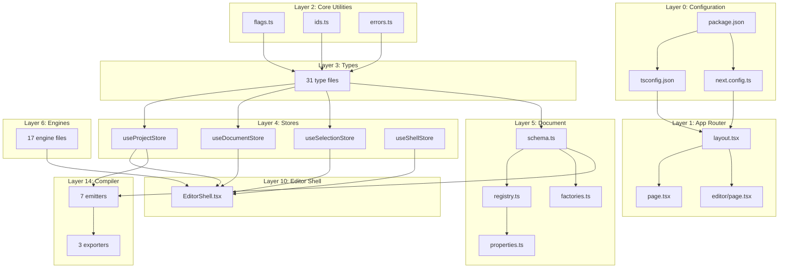

# 📚 LazyLayout — Learning Progress Tracker

> **Rule**: A file is marked ✅ only when Pranav explicitly says "I got it" or equivalent.  
> Until then every file stays ⬜ (not started) or 🔄 (explained, awaiting confirmation).

---

## 🏗️ What Is LazyLayout?

**LazyLayout** is an **AI-native motion design studio** — a visual editor where you author
interactive motion, effects, and UI components using GSAP, Framer Motion, SVG, and CSS.
The editor then **compiles** your visual design into clean, production-grade code that you
can drop into any external project.

Think of it like **Figma meets After Effects meets VS Code** — but for motion/animation,
and it outputs real code instead of just design files.

---

## 🗺️ Repository Architecture (Big Picture)

```
WebAPPBuilder/                     ← Root of the repo
│
├── package.json                   ← Project identity, deps, scripts
├── tsconfig.json                  ← TypeScript compiler settings
├── next.config.ts                 ← Next.js 16 configuration
├── eslint.config.mjs              ← Linting rules
├── playwright.config.ts           ← E2E testing configuration
├── .gitignore                     ← Files Git should ignore
├── next-env.d.ts                  ← Auto-generated Next.js types
│
├── src/                           ← ALL source code lives here
│   ├── app/                       ← Next.js App Router (pages/routes)
│   │   ├── layout.tsx             ← Root HTML shell (fonts, global CSS)
│   │   ├── page.tsx               ← Home page "/" → ProjectHub launcher
│   │   ├── editor/                ← "/editor" route → the studio
│   │   └── database/              ← "/database" route → DB studio
│   │
│   ├── core/                      ← 🧠 BRAIN — Pure logic, zero UI
│   │   ├── types/                 ← TypeScript type definitions (31 files)
│   │   ├── store/                 ← Zustand state stores (7 stores)
│   │   ├── document/              ← Document schema, registry, factories
│   │   ├── engine/                ← Validation, compilation, solvers (17 engines)
│   │   ├── ast/                   ← Abstract Syntax Tree management
│   │   ├── events/                ← Event bus, tear-off channels
│   │   ├── storage/               ← IndexedDB persistence, sessions
│   │   ├── nodescript/            ← Visual scripting language (lexer, parser)
│   │   ├── wasm/                  ← WebAssembly modules (physics, splines)
│   │   ├── runtime/               ← Multi-engine animation runtime
│   │   ├── profiler/              ← Performance measurement
│   │   ├── collab/                ← Real-time collaboration engine
│   │   ├── hooks/                 ← Shared React hooks
│   │   ├── ai/                    ← AI engine integration
│   │   ├── flags.ts               ← Build-time edition toggle
│   │   ├── ids.ts                 ← Collision-resistant ID generator
│   │   └── errors.ts              ← Error message utility
│   │
│   ├── editor/                    ← 🎨 UI — React components
│   │   ├── shell/                 ← App chrome (header, dock, toolbar, tabs)
│   │   ├── panels/                ← 24 feature panels (details, sequencer, etc.)
│   │   ├── canvas/                ← Visual canvas (whiteboard, 3D, cables)
│   │   ├── menus/                 ← File/Edit/View/Window/Help menus
│   │   ├── runtime/               ← SandboxHost (live preview iframe)
│   │   ├── styles/                ← 16 CSS files (tokens, panels, etc.)
│   │   └── (placeholder dirs)     ← blueprints, motion, viewport, dialogs, database
│   │
│   ├── compiler/                  ← 🔧 COMPILER — AST → Code
│   │   ├── emitters/              ← Code generators (React, GSAP, Vue, etc.)
│   │   ├── export/                ← Git export, ZIP packing
│   │   ├── ast-to-react/          ← (placeholder) AST → React components
│   │   ├── blueprint-to-js/       ← (placeholder) Blueprint → JS logic
│   │   ├── motion-to-gsap/        ← (placeholder) Motion → GSAP code
│   │   ├── schema-to-prisma/      ← (placeholder) Schema → Prisma ORM
│   │   ├── validator/             ← (placeholder) Code validation
│   │   └── bundler/               ← (placeholder) Bundle optimization
│   │
│   ├── runtime/                   ← ⚡ RUNTIME SERVICES
│   │   ├── HotReloadEngine.ts     ← Live preview hot-reload
│   │   ├── MockApiServer.ts       ← Fake API for testing
│   │   ├── MockDatabase.ts        ← In-memory database simulator
│   │   ├── DeploymentEngine.ts    ← Deploy to hosting providers
│   │   ├── ExecutionTracer.ts     ← Debugging execution flow
│   │   ├── GlobalSearchEngine.ts  ← Search across project
│   │   ├── ShortcutRegistry.ts    ← Keyboard shortcut management
│   │   └── ...more engines
│   │
│   └── ai/                        ← 🤖 AI SUBSYSTEM (mostly placeholder)
│       ├── agent/                  ← AI agent orchestration
│       ├── codegen/                ← AI code generation
│       ├── prompts/                ← Prompt templates
│       └── ...more modules
│
├── public/                        ← Static assets served as-is
│   ├── fonts/                     ← Custom font files
│   ├── icons/                     ← App icons
│   ├── Images/                    ← Image assets
│   └── templates/                 ← Starter templates
│
├── tests/                         ← Testing infrastructure
│   ├── e2e/                       ← Playwright end-to-end tests
│   └── export-harness/            ← Export validation fixtures
│
├── scripts/                       ← Build/CI helper scripts
├── bin/                           ← CLI tool (nodescript-cli)
├── extensions/                    ← VS Code extension
└── DOCS/                          ← Documentation
    ├── Initial/                   ← Current phase docs
    ├── After/                     ← Future vision docs
    └── Learn/                     ← 📚 YOUR LEARNING TRACKER (this!)
```

---

## 📋 File-by-File Learning Checklist

### Layer 0: Project Configuration (The Foundation)
| # | File | Status | Description |
|---|------|--------|-------------|
| 1 | `package.json` | ⬜ | Project identity, dependencies, npm scripts |
| 2 | `tsconfig.json` | ⬜ | TypeScript compiler options and path aliases |
| 3 | `next.config.ts` | ⬜ | Next.js 16 configuration |
| 4 | `.gitignore` | ⬜ | Git exclusion rules |
| 5 | `eslint.config.mjs` | ⬜ | Linting rules and standards |
| 6 | `next-env.d.ts` | ⬜ | Auto-generated Next.js type references |
| 7 | `playwright.config.ts` | ⬜ | E2E test configuration |

### Layer 1: App Router (How the website serves pages)
| # | File | Status | Description |
|---|------|--------|-------------|
| 8 | `src/app/layout.tsx` | ⬜ | Root HTML shell — fonts, global CSS |
| 9 | `src/app/page.tsx` | ⬜ | Home route `/` → launches ProjectHub |
| 10 | `src/app/editor/layout.tsx` | ⬜ | Editor route layout wrapper |
| 11 | `src/app/editor/page.tsx` | ⬜ | Editor route `/editor` → the studio |
| 12 | `src/app/database/page.tsx` | ⬜ | Database studio route |

### Layer 2: Core Utilities (Tiny helpers everything depends on)
| # | File | Status | Description |
|---|------|--------|-------------|
| 13 | `src/core/flags.ts` | ⬜ | Build-time edition toggle (initial vs full) |
| 14 | `src/core/ids.ts` | ⬜ | Collision-resistant ID generator |
| 15 | `src/core/errors.ts` | ⬜ | Safe error message extractor |

### Layer 3: Type System (Data shape definitions)
| # | File | Status | Description |
|---|------|--------|-------------|
| 16 | `src/core/types/animations.ts` | ⬜ | Animation data structures |
| 17 | `src/core/types/details.ts` | ⬜ | Property inspector types |
| 18 | `src/core/types/node-registry.ts` | ⬜ | Node/element registry types |
| 19 | `src/core/types/element-grammar.ts` | ⬜ | Element grammar/structure types |
| 20 | `src/core/types/svg.ts` | ⬜ | SVG element types |
| 21 | `src/core/types/compiler.ts` | ⬜ | Compiler pipeline types |
| 22 | `src/core/types/environment.ts` | ⬜ | Environment config types |
| 23 | `src/core/types/database.ts` | ⬜ | Database schema types |
| 24 | `src/core/types/scene3d.ts` | ⬜ | 3D scene types |
| 25 | `src/core/types/theme.ts` | ⬜ | Theme/design token types |
| 26 | `src/core/types/diagnostics.ts` | ⬜ | Diagnostics/error types |
| 27 | `src/core/types/profiler.ts` | ⬜ | Performance profiler types |
| 28 | `src/core/types/deployment.ts` | ⬜ | Deployment config types |
| 29 | `src/core/types/debugger.ts` | ⬜ | Debugger state types |
| 30 | `src/core/types/routing.ts` | ⬜ | Page routing types |
| 31 | `src/core/types/search.ts` | ⬜ | Search result types |
| 32 | `src/core/types/shortcuts.ts` | ⬜ | Keyboard shortcut types |
| 33 | `src/core/types/trace.ts` | ⬜ | Execution trace types |
| 34 | `src/core/types/watch.ts` | ⬜ | Watch expression types |
| 35 | `src/core/types/versioning.ts` | ⬜ | Version control types |
| 36 | `src/core/types/history.ts` | ⬜ | Undo/redo history types |
| 37 | `src/core/types/workspace.ts` | ⬜ | Workspace layout types |
| 38 | `src/core/types/collab.ts` | ⬜ | Collaboration state types |
| 39 | `src/core/types/collaboration.ts` | ⬜ | Collaboration protocol types |
| 40 | `src/core/types/comments.ts` | ⬜ | Comment/annotation types |
| 41 | `src/core/types/data-binding.ts` | ⬜ | Data binding types |
| 42 | `src/core/types/dependencies.ts` | ⬜ | Dependency analysis types |
| 43 | `src/core/types/element-sections.ts` | ⬜ | Element section structure types |
| 44 | `src/core/types/mock-database.ts` | ⬜ | Mock database types |
| 45 | `src/core/types/plugin.ts` | ⬜ | Plugin system types |
| 46 | `src/core/types/svg-filters-gradients.ts` | ⬜ | SVG filter/gradient types |

### Layer 4: State Stores (Zustand — global application state)
| # | File | Status | Description |
|---|------|--------|-------------|
| 47 | `src/core/store/useProjectStore.ts` | ⬜ | Main project state (largest store) |
| 48 | `src/core/store/useDocumentStore.ts` | ⬜ | Document/element CRUD operations |
| 49 | `src/core/store/useSelectionStore.ts` | ⬜ | Selection tracking |
| 50 | `src/core/store/useShellStore.ts` | ⬜ | UI shell state (panels, layout) |
| 51 | `src/core/store/useHistoryStore.ts` | ⬜ | Undo/redo history |
| 52 | `src/core/store/useCollabStore.ts` | ⬜ | Collaboration state |
| 53 | `src/core/store/useDependencyStore.ts` | ⬜ | Dependency graph state |
| 54 | `src/core/store/useVersionControlStore.ts` | ⬜ | Version control state |

### Layer 5: Document System (Schema, factories, properties)
| # | File | Status | Description |
|---|------|--------|-------------|
| 55 | `src/core/document/schema.ts` | ⬜ | Zod schema for document validation |
| 56 | `src/core/document/registry.ts` | ⬜ | Element type registry |
| 57 | `src/core/document/factories.ts` | ⬜ | Element creation factories |
| 58 | `src/core/document/properties.ts` | ⬜ | Property editing logic (largest file) |
| 59 | `src/core/document/props.ts` | ⬜ | Property helpers |
| 60 | `src/core/document/diff.ts` | ⬜ | Document diffing |

### Layer 6: Engines (Core computation and validation)
| # | File | Status | Description |
|---|------|--------|-------------|
| 61 | `src/core/engine/ElementGrammarEngine.ts` | ⬜ | Element structure validation |
| 62 | `src/core/engine/PathMorphSolver.ts` | ⬜ | SVG path morphing computation |
| 63 | `src/core/engine/SvgFilterGradientEngine.ts` | ⬜ | SVG filter/gradient engine |
| 64 | `src/core/engine/VersionControlEngine.ts` | ⬜ | Git-like versioning |
| 65 | `src/core/engine/DependencyAnalysisEngine.ts` | ⬜ | Dependency graph analysis |
| 66 | `src/core/engine/Scene3DEngine.ts` | ⬜ | 3D scene management |
| 67 | `src/core/engine/AnimationLoweringCompiler.ts` | ⬜ | Animation to runtime lowering |
| 68 | `src/core/engine/GSAPTimelineCompiler.ts` | ⬜ | GSAP timeline compilation |
| 69 | `src/core/engine/DiagnosticBus.ts` | ⬜ | Diagnostic message routing |
| 70 | `src/core/engine/DataBindingValidator.ts` | ⬜ | Data binding validation |
| 71 | `src/core/engine/DatabaseValidator.ts` | ⬜ | Database schema validation |
| 72 | `src/core/engine/StateVariableValidator.ts` | ⬜ | State variable validation |
| 73 | `src/core/engine/Scene3DAnimationEngine.ts` | ⬜ | 3D animation engine |
| 74 | `src/core/engine/GLTFAssetPipeline.ts` | ⬜ | 3D asset loading |
| 75 | `src/core/engine/ConnectionPipeline.ts` | ⬜ | Node connection validation |
| 76 | `src/core/engine/AnimationValidator.ts` | ⬜ | Animation validation |
| 77 | `src/core/engine/grammarHelpers.ts` | ⬜ | Grammar engine utilities |

### Layer 7: AST, Events, Storage, Hooks
| # | File | Status | Description |
|---|------|--------|-------------|
| 78 | `src/core/ast/ASTManager.ts` | ⬜ | AST tree management |
| 79 | `src/core/ast/DAGSorter.ts` | ⬜ | Directed Acyclic Graph sort |
| 80 | `src/core/ast/TypeChecker.ts` | ⬜ | Blueprint type checking |
| 81 | `src/core/events/EventBus.ts` | ⬜ | Pub/sub event system |
| 82 | `src/core/events/useTearOff.ts` | ⬜ | Panel tear-off hook |
| 83 | `src/core/events/useTearOffChannel.ts` | ⬜ | Tear-off communication |
| 84 | `src/core/storage/idb.ts` | ⬜ | IndexedDB wrapper |
| 85 | `src/core/storage/ProjectDatabase.ts` | ⬜ | Project persistence |
| 86 | `src/core/storage/ProjectSession.ts` | ⬜ | Session management |
| 87 | `src/core/storage/DemoProjectSnapshot.ts` | ⬜ | Demo project data |
| 88 | `src/core/storage/lazyFile.ts` | ⬜ | Lazy file loading |
| 89 | `src/core/hooks/useLatestRef.ts` | ⬜ | Latest ref hook |
| 90 | `src/core/hooks/useNow.ts` | ⬜ | Current time hook |

### Layer 8: NodeScript (Visual Scripting Language)
| # | File | Status | Description |
|---|------|--------|-------------|
| 91 | `src/core/nodescript/types.ts` | ⬜ | NodeScript AST types |
| 92 | `src/core/nodescript/grammar.peg` | ⬜ | PEG grammar definition |
| 93 | `src/core/nodescript/Lexer.ts` | ⬜ | Token scanner |
| 94 | `src/core/nodescript/Parser.ts` | ⬜ | Syntax tree builder |
| 95 | `src/core/nodescript/Serializer.ts` | ⬜ | AST serializer |
| 96 | `src/core/nodescript/GraphGenerator.ts` | ⬜ | Graph from AST |
| 97 | `src/core/nodescript/LanguageServer.ts` | ⬜ | IDE-like language services |
| 98 | `src/core/nodescript/stdlib.ts` | ⬜ | Standard library functions |
| 99 | `src/core/nodescript/language-server-types.ts` | ⬜ | Language server types |
| 100 | `src/core/nodescript/index.ts` | ⬜ | Module barrel export |

### Layer 9: WASM, Runtime Core, Profiler, Collaboration, AI
| # | File | Status | Description |
|---|------|--------|-------------|
| 101 | `src/core/wasm/WasmBridge.ts` | ⬜ | WASM module loader |
| 102 | `src/core/wasm/WasmWorkerPool.ts` | ⬜ | Web Worker pool |
| 103 | `src/core/wasm/SplineSolver.ts` | ⬜ | Spline math solver |
| 104 | `src/core/wasm/CablePhysics.ts` | ⬜ | Cable physics simulation |
| 105 | `src/core/wasm/SpatialIndex.ts` | ⬜ | Spatial indexing for canvas |
| 106 | `src/core/wasm/SimdBenchmark.ts` | ⬜ | SIMD performance testing |
| 107 | `src/core/runtime/MultiEngineAnimationRuntime.ts` | ⬜ | Multi-engine animation runner |
| 108 | `src/core/runtime/EngineAdapters.ts` | ⬜ | Engine adapter interfaces |
| 109 | `src/core/profiler/PerformanceProfiler.ts` | ⬜ | Performance measurement |
| 110 | `src/core/collab/PresenceEngine.ts` | ⬜ | Multi-user presence |
| 111 | `src/core/ai/MotionAiEngine.ts` | ⬜ | AI motion generation |
| 112 | `src/core/ai/MotionDiagnostics.ts` | ⬜ | AI diagnostics |

### Layer 10: Editor Shell (App Chrome)
| # | File | Status | Description |
|---|------|--------|-------------|
| 113 | `src/editor/shell/EditorShell.tsx` | ⬜ | Main editor layout orchestrator |
| 114 | `src/editor/shell/StudioHeader.tsx` | ⬜ | Top header bar |
| 115 | `src/editor/shell/MainToolbar.tsx` | ⬜ | Primary toolbar |
| 116 | `src/editor/shell/StatusBar.tsx` | ⬜ | Bottom status bar |
| 117 | `src/editor/shell/DockZone.tsx` | ⬜ | Dockable panel zone |
| 118 | `src/editor/shell/DockTabBar.tsx` | ⬜ | Panel tab bar |
| 119 | `src/editor/shell/DockSplitter.tsx` | ⬜ | Resizable splitter |
| 120 | `src/editor/shell/DockCornerSplitter.tsx` | ⬜ | Corner splitter handle |
| 121 | `src/editor/shell/FullPageDock.tsx` | ⬜ | Full-page panel dock |
| 122 | `src/editor/shell/CommandPalette.tsx` | ⬜ | Ctrl+P command palette |
| 123 | `src/editor/shell/WorkspaceTabStrip.tsx` | ⬜ | Multi-workspace tabs |
| 124 | `src/editor/shell/PersistenceUi.tsx` | ⬜ | Save/load UI |
| 125 | `src/editor/shell/CollaboratorAvatarStack.tsx` | ⬜ | Multi-user avatars |
| 126 | `src/editor/shell/DetachedPanelShell.tsx` | ⬜ | Torn-off panel window |
| 127 | `src/editor/shell/TearOffDragOverlay.tsx` | ⬜ | Tear-off drag visual |
| 128 | `src/editor/shell/afterTrackPanels.tsx` | ⬜ | After-track panel registry |

### Layer 11: Canvas (Visual Workspace)
| # | File | Status | Description |
|---|------|--------|-------------|
| 129 | `src/editor/canvas/WhiteboardCanvas.tsx` | ⬜ | Main 2D whiteboard |
| 130 | `src/editor/canvas/WasmCableCanvas.tsx` | ⬜ | WASM-powered cable rendering |
| 131 | `src/editor/canvas/CanvasOverlay.tsx` | ⬜ | Canvas overlay layer |
| 132 | `src/editor/canvas/Scene3DViewport.tsx` | ⬜ | 3D viewport |
| 133 | `src/editor/canvas/FloatingDock.tsx` | ⬜ | Floating tool dock |
| 134 | `src/editor/canvas/ZoomControls.tsx` | ⬜ | Zoom in/out controls |
| 135 | `src/editor/canvas/CollabCursorOverlay.tsx` | ⬜ | Multi-user cursor overlay |

### Layer 12: Panels (Feature Panels)
*(Will expand this list as we reach this layer — approximately 50 components)*

### Layer 13: Styles (CSS Design System)
| # | File | Status | Description |
|---|------|--------|-------------|
| 136 | `src/editor/styles/tokens.css` | ⬜ | Design tokens (CSS variables) |
| 137 | `src/editor/styles/globals.css` | ⬜ | Global reset and base styles |
| 138 | `src/editor/styles/animations.css` | ⬜ | Keyframe animations |
| 139 | `src/editor/styles/panels.css` | ⬜ | Panel component styles |
| 140 | `src/editor/styles/dock.css` | ⬜ | Dock system styles |
| 141 | `src/editor/styles/launcher.css` | ⬜ | Project hub styles |
| 142 | `src/editor/styles/menus.css` | ⬜ | Menu styles |
| 143 | `src/editor/styles/forms.css` | ⬜ | Form control styles |
| 144 | `src/editor/styles/sequencer.css` | ⬜ | Timeline sequencer styles |
| 145 | `src/editor/styles/whiteboard.css` | ⬜ | Canvas whiteboard styles |
| 146 | `src/editor/styles/ai-copilot.css` | ⬜ | AI copilot panel styles |
| 147 | `src/editor/styles/database-studio.css` | ⬜ | Database studio styles |
| 148 | `src/editor/styles/code-inspector.css` | ⬜ | Code inspector styles |
| 149 | `src/editor/styles/detached.css` | ⬜ | Detached panel styles |
| 150 | `src/editor/styles/fullpage-dock.css` | ⬜ | Full page dock styles |
| 151 | `src/editor/styles/showcase.css` | ⬜ | Showcase/demo styles |

### Layer 14: Compiler Pipeline
| # | File | Status | Description |
|---|------|--------|-------------|
| 152 | `src/compiler/emitters/index.ts` | ⬜ | Emitter barrel exports |
| 153 | `src/compiler/emitters/ReactComponentEmitter.ts` | ⬜ | React code generator |
| 154 | `src/compiler/emitters/GSAPAnimationEmitter.ts` | ⬜ | GSAP code generator |
| 155 | `src/compiler/emitters/StyleEmitter.ts` | ⬜ | CSS code generator |
| 156 | `src/compiler/emitters/LogicFlowEmitter.ts` | ⬜ | Logic flow code generator |
| 157 | `src/compiler/emitters/PrismaSchemaEmitter.ts` | ⬜ | Prisma schema generator |
| 158 | `src/compiler/emitters/ApiRouteEmitter.ts` | ⬜ | API route generator |
| 159 | `src/compiler/emitters/ThreeSceneEmitter.ts` | ⬜ | Three.js scene generator |
| 160 | `src/compiler/export/CrossFrameworkExporter.ts` | ⬜ | Cross-framework export |
| 161 | `src/compiler/export/GitExporter.ts` | ⬜ | Git-based export |
| 162 | `src/compiler/export/ZipPacker.ts` | ⬜ | ZIP file packing |
| 163 | `src/compiler/export/index.ts` | ⬜ | Export barrel |

### Layer 15: Runtime Services
| # | File | Status | Description |
|---|------|--------|-------------|
| 164 | `src/runtime/HotReloadEngine.ts` | ⬜ | Hot module reload |
| 165 | `src/runtime/MockApiServer.ts` | ⬜ | Fake REST API server |
| 166 | `src/runtime/MockDatabase.ts` | ⬜ | In-memory database |
| 167 | `src/runtime/DeploymentEngine.ts` | ⬜ | Deployment orchestration |
| 168 | `src/runtime/ExecutionTracer.ts` | ⬜ | Execution debugging |
| 169 | `src/runtime/GlobalSearchEngine.ts` | ⬜ | Full-text search |
| 170 | `src/runtime/ShortcutRegistry.ts` | ⬜ | Keyboard shortcuts |
| 171 | `src/runtime/BreakpointManager.ts` | ⬜ | Debug breakpoints |
| 172 | `src/runtime/WatchExpressionManager.ts` | ⬜ | Watch expressions |
| 173 | `src/runtime/PerformanceProfiler.ts` | ⬜ | Runtime profiling |
| 174 | `src/runtime/PluginManagerEngine.ts` | ⬜ | Plugin management |

### Layer 16: Menus and Runtime UI
| # | File | Status | Description |
|---|------|--------|-------------|
| 175 | `src/editor/menus/FileMenu.tsx` | ⬜ | File menu |
| 176 | `src/editor/menus/EditMenu.tsx` | ⬜ | Edit menu |
| 177 | `src/editor/menus/ViewMenu.tsx` | ⬜ | View menu |
| 178 | `src/editor/menus/WindowMenu.tsx` | ⬜ | Window menu |
| 179 | `src/editor/menus/HelpMenu.tsx` | ⬜ | Help menu |
| 180 | `src/editor/runtime/SandboxHost.tsx` | ⬜ | Live preview sandbox |

---

## 📊 Overall Progress

| Layer | Files | Done | Percentage |
|-------|-------|------|------------|
| 0 — Configuration | 7 | 0 | 0% |
| 1 — App Router | 5 | 0 | 0% |
| 2 — Core Utilities | 3 | 0 | 0% |
| 3 — Type System | 31 | 0 | 0% |
| 4 — State Stores | 8 | 0 | 0% |
| 5 — Document System | 6 | 0 | 0% |
| 6 — Engines | 17 | 0 | 0% |
| 7 — AST/Events/Storage | 13 | 0 | 0% |
| 8 — NodeScript | 10 | 0 | 0% |
| 9 — WASM/Runtime/AI | 12 | 0 | 0% |
| 10 — Editor Shell | 16 | 0 | 0% |
| 11 — Canvas | 7 | 0 | 0% |
| 12 — Panels | ~50 | 0 | 0% |
| 13 — Styles | 16 | 0 | 0% |
| 14 — Compiler | 12 | 0 | 0% |
| 15 — Runtime Services | 11 | 0 | 0% |
| 16 — Menus and Runtime UI | 6 | 0 | 0% |
| **TOTAL** | **~230** | **0** | **0%** |

---

## 🔗 File Dependency Diagram



---

## 🚦 Current Position

**Next file to study**: `package.json` (#1)  
**We start from absolute zero.**
