# 📦 UNTRACKED — Complete File Registry

> Every file in the LazyLayout repository, organized by folder.  
> As you learn each file and it moves to [PROGRESS.md](./PROGRESS.md), it gets marked here too.  
> **Status**: ⬜ = Not started | 🔄 = Explained | ✅ = Understood & moved to PROGRESS

---

## `/` — Root Configuration Files

| File | Status | Description |
|------|--------|-------------|
| `package.json` | ⬜ | Project identity — name, version, dependencies, npm scripts |
| `tsconfig.json` | ⬜ | TypeScript compiler options, path aliases (`@/core/*`, etc.) |
| `next.config.ts` | ⬜ | Next.js 16 config — COOP/COEP headers for SharedArrayBuffer |
| `.gitignore` | ⬜ | Git exclusion rules — node_modules, .next, .env, WASM dist |
| `eslint.config.mjs` | ⬜ | ESLint 9 flat config — Next.js rules + exhaustive-deps enforcement |
| `next-env.d.ts` | ⬜ | Auto-generated type references for Next.js |
| `playwright.config.ts` | ⬜ | E2E test config — 3 browsers, production build, 60s timeout |
| `README.md` | ⬜ | Project overview, getting started guide, script reference |
| `AGENTS.md` | ⬜ | AI agent instructions — "this is NOT the Next.js you know" |
| `CLAUDE.md` | ⬜ | Claude AI integration config |

---

## `src/app/` — Next.js App Router (Page Routes)

| File | Status | Description |
|------|--------|-------------|
| `src/app/layout.tsx` | ⬜ | Root HTML shell — loads Inter + JetBrains Mono fonts, global CSS |
| `src/app/page.tsx` | ⬜ | Home route `/` — renders `<ProjectHub />` launcher |
| `src/app/editor/layout.tsx` | ⬜ | Editor route layout wrapper — metadata for `/editor` |
| `src/app/editor/page.tsx` | ⬜ | Editor route `/editor` — renders `<EditorShell />` |
| `src/app/editor/detach/[panelId]/layout.tsx` | ⬜ | Detached panel route layout — dynamic `[panelId]` segment |
| `src/app/editor/detach/[panelId]/page.tsx` | ⬜ | Detached panel page — renders torn-off panel in own window |
| `src/app/database/page.tsx` | ⬜ | Database studio route — renders `<DatabaseStudio />` |

---

## `src/core/` — Core Utilities (3 tiny helpers)

| File | Status | Description |
|------|--------|-------------|
| `src/core/flags.ts` | ⬜ | Build-time `edition` flag — "initial" (motion editor) vs "full" |
| `src/core/ids.ts` | ⬜ | `createId(prefix)` — collision-resistant IDs using `crypto.getRandomValues` |
| `src/core/errors.ts` | ⬜ | `errorMessage(err)` — safely extracts message from `unknown` catches |

---

## `src/core/types/` — TypeScript Type Definitions (31 files)

| File | Status | Description |
|------|--------|-------------|
| `src/core/types/animations.ts` | ⬜ | Animation keyframes, timelines, easing, scroll-trigger types |
| `src/core/types/details.ts` | ⬜ | Property inspector panel types — section definitions, field types |
| `src/core/types/node-registry.ts` | ⬜ | Node catalog — archetypes, categories, ports, node definitions |
| `src/core/types/element-grammar.ts` | ⬜ | Element hierarchy rules — which elements can nest inside which |
| `src/core/types/element-sections.ts` | ⬜ | Element section structure — how sections are organized per type |
| `src/core/types/svg.ts` | ⬜ | SVG element types — paths, shapes, groups, viewBox |
| `src/core/types/svg-filters-gradients.ts` | ⬜ | SVG filters (blur, shadow) and gradient types |
| `src/core/types/compiler.ts` | ⬜ | Compiler pipeline types — emitter configs, target frameworks |
| `src/core/types/environment.ts` | ⬜ | World environment config — backgrounds, lighting, fog |
| `src/core/types/database.ts` | ⬜ | Database schema types — entities, fields, relations, mock data |
| `src/core/types/scene3d.ts` | ⬜ | 3D scene types — meshes, materials, cameras, lights |
| `src/core/types/theme.ts` | ⬜ | Theme types — color palettes, spacing scales, design tokens |
| `src/core/types/diagnostics.ts` | ⬜ | Diagnostic message types — errors, warnings, info, severity |
| `src/core/types/profiler.ts` | ⬜ | Performance profiler types — metrics, flamegraph entries |
| `src/core/types/deployment.ts` | ⬜ | Deployment config — providers, domains, build settings |
| `src/core/types/debugger.ts` | ⬜ | Debugger state — breakpoints, call stack, variables |
| `src/core/types/routing.ts` | ⬜ | Page routing — route definitions, navigation flow |
| `src/core/types/search.ts` | ⬜ | Search result types — matches, filters, ranking |
| `src/core/types/shortcuts.ts` | ⬜ | Keyboard shortcut types — key combos, contexts, actions |
| `src/core/types/trace.ts` | ⬜ | Execution trace types — call entries, timeline events |
| `src/core/types/watch.ts` | ⬜ | Watch expression types — monitored variables, live values |
| `src/core/types/versioning.ts` | ⬜ | Version control types — commits, branches, diffs |
| `src/core/types/history.ts` | ⬜ | Undo/redo history — action entries, state snapshots |
| `src/core/types/workspace.ts` | ⬜ | Workspace layout — panel positions, dock zones |
| `src/core/types/collab.ts` | ⬜ | Collaboration state — user presence, cursors |
| `src/core/types/collaboration.ts` | ⬜ | Collaboration protocol — sync messages, conflict resolution |
| `src/core/types/comments.ts` | ⬜ | Comment/annotation types — threads, pins, resolved state |
| `src/core/types/data-binding.ts` | ⬜ | Data binding types — source/target, transforms |
| `src/core/types/dependencies.ts` | ⬜ | Dependency analysis — reference graphs, import chains |
| `src/core/types/mock-database.ts` | ⬜ | Mock database types — seed data, query results |
| `src/core/types/plugin.ts` | ⬜ | Plugin system types — manifest, lifecycle hooks |

---

## `src/core/store/` — Zustand State Stores (7 stores)

| File | Status | Description |
|------|--------|-------------|
| `src/core/store/useProjectStore.ts` | ⬜ | **Master store** — elements, animations, 3D scenes, state vars, blueprints |
| `src/core/store/useDocumentStore.ts` | ⬜ | Document CRUD — add/remove/update elements, persist to IndexedDB |
| `src/core/store/useSelectionStore.ts` | ⬜ | Selection tracking — which elements are currently selected |
| `src/core/store/useShellStore.ts` | ⬜ | UI shell state — which panels are open, dock layout |
| `src/core/store/useHistoryStore.ts` | ⬜ | Undo/redo stack — action recording, state restoration |
| `src/core/store/useCollabStore.ts` | ⬜ | Collaboration — connected users, cursor positions, presence |
| `src/core/store/useDependencyStore.ts` | ⬜ | Dependency graph — element references, import tracking |
| `src/core/store/useVersionControlStore.ts` | ⬜ | Version control — commits, branches, staging |

---

## `src/core/document/` — Document Schema & Operations

| File | Status | Description |
|------|--------|-------------|
| `src/core/document/schema.ts` | ⬜ | Zod schemas validating the document JSON structure |
| `src/core/document/registry.ts` | ⬜ | Element type registry — maps type names to their definitions |
| `src/core/document/factories.ts` | ⬜ | Factory functions to create new elements with defaults |
| `src/core/document/properties.ts` | ⬜ | Property editing engine — the largest core file (~52KB) |
| `src/core/document/props.ts` | ⬜ | Property accessor helpers |
| `src/core/document/diff.ts` | ⬜ | Document diffing — compare two document states |
| `src/core/document/migrations/index.ts` | ⬜ | Migration runner — applies schema migrations in sequence |
| `src/core/document/migrations/v1-to-v2.ts` | ⬜ | Schema migration from version 1 → 2 |
| `src/core/document/migrations/v2-to-v3.ts` | ⬜ | Schema migration from version 2 → 3 |
| `src/core/document/migrations/v3-to-v4.ts` | ⬜ | Schema migration from version 3 → 4 (Phase 7): new collections, typed behaviour params, clip timing repairs |
| `src/core/document/motion.ts` | ⬜ | Phase 7.2–7.3 primitives: easing grammar, springs, keyframes, tracks, staggers, clips, sequences, states, transitions, typed behaviours |
| `src/core/document/signals.ts` | ⬜ | Phase 7.5 bindings: signals, operators, targets, guards, and the `signal \|> operators -> target` text-form parser/printer |
| `src/core/document/effects.ts` | ⬜ | Phase 7.4–7.5: GPU surfaces (fallback chains, policies), input tapes, effect instances |
| `src/core/document/effect-definition.ts` | ⬜ | Phase 7.4: the library effect definition format and instance checks |
| `src/core/document/graph.ts` | ⬜ | Phase 7.5: interaction graphs (Blueprint model): nodes, typed pins, wires, variables, custom events |
| `src/core/document/kinetics.ts` | ⬜ | Phase 7.5 Track K: pins, tags, Follow/Field/Effector/Collider/Body components, Split/Clone generators |
| `src/core/document/behaviour-presets.ts` | ⬜ | Phase 7.5: expands each behaviour into bindings (or a body / looping clip) |
| `src/core/document/references.ts` | ⬜ | Cross-entity validation: every id, pin, tag, state, uniform and property path resolves |
| `src/core/document/compositions.ts` | ⬜ | Phase 46 time model: main/interaction/precomp compositions, layer time bars, nesting, markers, time maths |
| `src/core/document/migrations/v4-to-v5.ts` | ⬜ | Schema migration from version 4 → 5 (Phase 46): adds the main composition and places every clip |

---

## `src/core/engine/` — Computation Engines (17 files)

| File | Status | Description |
|------|--------|-------------|
| `src/core/engine/ElementGrammarEngine.ts` | ⬜ | Validates element nesting rules (which elements go inside which) |
| `src/core/engine/PathMorphSolver.ts` | ⬜ | SVG path morphing — interpolates between two SVG paths |
| `src/core/engine/SvgFilterGradientEngine.ts` | ⬜ | Manages SVG filters (blur, drop-shadow) and gradients |
| `src/core/engine/VersionControlEngine.ts` | ⬜ | Git-like versioning — commits, diffs, branches |
| `src/core/engine/DependencyAnalysisEngine.ts` | ⬜ | Analyzes element dependency chains and circular references |
| `src/core/engine/Scene3DEngine.ts` | ⬜ | 3D scene graph management — meshes, lights, cameras |
| `src/core/engine/Scene3DAnimationEngine.ts` | ⬜ | Animates 3D scene objects |
| `src/core/engine/AnimationLoweringCompiler.ts` | ⬜ | "Lowers" high-level animation → runtime-ready instructions |
| `src/core/engine/GSAPTimelineCompiler.ts` | ⬜ | Compiles animations into GSAP timeline calls |
| `src/core/engine/DiagnosticBus.ts` | ⬜ | Central bus for collecting/routing diagnostic messages |
| `src/core/engine/DataBindingValidator.ts` | ⬜ | Validates data binding expressions |
| `src/core/engine/DatabaseValidator.ts` | ⬜ | Validates database schema definitions |
| `src/core/engine/StateVariableValidator.ts` | ⬜ | Validates state variable declarations |
| `src/core/engine/GLTFAssetPipeline.ts` | ⬜ | Loads and processes glTF 3D model assets |
| `src/core/engine/ConnectionPipeline.ts` | ⬜ | Validates node-to-node connections in blueprints |
| `src/core/engine/AnimationValidator.ts` | ⬜ | Validates animation configurations |
| `src/core/engine/grammarHelpers.ts` | ⬜ | Utility functions for the grammar engine |

---

## `src/core/ast/` — Abstract Syntax Tree

| File | Status | Description |
|------|--------|-------------|
| `src/core/ast/ASTManager.ts` | ⬜ | Builds and manages the blueprint AST tree |
| `src/core/ast/DAGSorter.ts` | ⬜ | Topological sort of Directed Acyclic Graph nodes |
| `src/core/ast/TypeChecker.ts` | ⬜ | Type-checks blueprint pin connections |

---

## `src/core/events/` — Event System

| File | Status | Description |
|------|--------|-------------|
| `src/core/events/EventBus.ts` | ⬜ | Publish/subscribe event system for inter-module communication |
| `src/core/events/useTearOff.ts` | ⬜ | React hook for panel tear-off (drag panel into separate window) |
| `src/core/events/useTearOffChannel.ts` | ⬜ | BroadcastChannel API for communicating with torn-off panels |

---

## `src/core/storage/` — Persistence Layer

| File | Status | Description |
|------|--------|-------------|
| `src/core/storage/idb.ts` | ⬜ | Low-level IndexedDB wrapper (open, get, put, delete) |
| `src/core/storage/ProjectDatabase.ts` | ⬜ | High-level project persistence — save/load entire projects |
| `src/core/storage/ProjectSession.ts` | ⬜ | Session management — auto-save, restore workspace state |
| `src/core/storage/DemoProjectSnapshot.ts` | ⬜ | Pre-built demo project data for first-run experience |
| `src/core/storage/lazyFile.ts` | ⬜ | Lazy file loading — deferred asset loading for performance |

---

## `src/core/hooks/` — Shared React Hooks

| File | Status | Description |
|------|--------|-------------|
| `src/core/hooks/useLatestRef.ts` | ⬜ | Always-current ref — avoids stale closure bugs |
| `src/core/hooks/useNow.ts` | ⬜ | Real-time clock hook — returns current timestamp |

---

## `src/core/nodescript/` — Visual Scripting Language (10 files)

| File | Status | Description |
|------|--------|-------------|
| `src/core/nodescript/types.ts` | ⬜ | AST node types — expressions, statements, literals |
| `src/core/nodescript/grammar.peg` | ⬜ | PEG grammar definition — the language's formal rules |
| `src/core/nodescript/Lexer.ts` | ⬜ | Tokenizer — breaks source text into tokens |
| `src/core/nodescript/Parser.ts` | ⬜ | Parser — builds AST from token stream |
| `src/core/nodescript/Serializer.ts` | ⬜ | Serializer — converts AST back to source text |
| `src/core/nodescript/GraphGenerator.ts` | ⬜ | Generates visual node graph from AST |
| `src/core/nodescript/LanguageServer.ts` | ⬜ | IDE services — autocomplete, hover info, go-to-definition |
| `src/core/nodescript/stdlib.ts` | ⬜ | Standard library — built-in functions (math, string, etc.) |
| `src/core/nodescript/language-server-types.ts` | ⬜ | Type definitions for language server protocol |
| `src/core/nodescript/index.ts` | ⬜ | Barrel export — re-exports public API |

---

## `src/core/wasm/` — WebAssembly Modules (7 files)

| File | Status | Description |
|------|--------|-------------|
| `src/core/wasm/WasmBridge.ts` | ⬜ | Loads and initializes WASM modules into JS |
| `src/core/wasm/WasmWorkerPool.ts` | ⬜ | Thread pool of Web Workers for parallel WASM work |
| `src/core/wasm/SplineSolver.ts` | ⬜ | Cubic/bezier spline math for smooth curves |
| `src/core/wasm/CablePhysics.ts` | ⬜ | Physics simulation for cable/wire connections |
| `src/core/wasm/SpatialIndex.ts` | ⬜ | R-tree spatial indexing for fast canvas hit-testing |
| `src/core/wasm/SimdBenchmark.ts` | ⬜ | SIMD (CPU vector ops) performance benchmarking |
| `src/core/wasm/types/worker-pool.ts` | ⬜ | Type definitions for the worker pool messages |

---

## `src/core/runtime/` — Core Animation Runtime

| File | Status | Description |
|------|--------|-------------|
| `src/core/runtime/MultiEngineAnimationRuntime.ts` | ⬜ | Orchestrates multiple animation engines (GSAP, Motion, CSS) |
| `src/core/runtime/EngineAdapters.ts` | ⬜ | Adapter interfaces for each animation engine |

---

## `src/core/profiler/` — Performance Measurement

| File | Status | Description |
|------|--------|-------------|
| `src/core/profiler/PerformanceProfiler.ts` | ⬜ | Measures and records performance metrics |

---

## `src/core/collab/` — Collaboration Engine

| File | Status | Description |
|------|--------|-------------|
| `src/core/collab/PresenceEngine.ts` | ⬜ | Multi-user presence — cursor sharing, live awareness |

---

## `src/core/ai/` — AI Engine Integration

| File | Status | Description |
|------|--------|-------------|
| `src/core/ai/MotionAiEngine.ts` | ⬜ | AI-powered motion generation and suggestion |
| `src/core/ai/MotionDiagnostics.ts` | ⬜ | AI diagnostic analysis of animations |

---

## `src/core/motion/presets/` — Motion Presets (6 files)

| File | Status | Description |
|------|--------|-------------|
| `src/core/motion/presets/types.ts` | ⬜ | Preset type definitions |
| `src/core/motion/presets/structuralPresets.ts` | ⬜ | Presets for structural elements (div, section, container) |
| `src/core/motion/presets/textPresets.ts` | ⬜ | Presets for text elements (heading, paragraph, label) |
| `src/core/motion/presets/interactivePresets.ts` | ⬜ | Presets for interactive elements (button, input, link) |
| `src/core/motion/presets/mediaPresets.ts` | ⬜ | Presets for media elements (image, video, icon) |
| `src/core/motion/presets/index.ts` | ⬜ | Barrel export and preset registry |

---

## `src/editor/shell/` — App Chrome (16 files)

| File | Status | Description |
|------|--------|-------------|
| `src/editor/shell/EditorShell.tsx` | ⬜ | **Master orchestrator** — all panels, docks, toolbar (~90KB) |
| `src/editor/shell/StudioHeader.tsx` | ⬜ | Top header — logo, menus, project name, share button |
| `src/editor/shell/MainToolbar.tsx` | ⬜ | Primary toolbar — select, pan, zoom, mode toggles |
| `src/editor/shell/StatusBar.tsx` | ⬜ | Bottom bar — zoom level, cursor coords, diagnostics count |
| `src/editor/shell/DockZone.tsx` | ⬜ | Dockable panel container — manages panel placement |
| `src/editor/shell/DockTabBar.tsx` | ⬜ | Tab bar inside dock zones — switch between panels |
| `src/editor/shell/DockSplitter.tsx` | ⬜ | Draggable splitter between dock zones |
| `src/editor/shell/DockCornerSplitter.tsx` | ⬜ | Corner handle for simultaneous H+V resize |
| `src/editor/shell/FullPageDock.tsx` | ⬜ | Full-page takeover panel (database studio, etc.) |
| `src/editor/shell/CommandPalette.tsx` | ⬜ | Ctrl+P fuzzy search command palette |
| `src/editor/shell/WorkspaceTabStrip.tsx` | ⬜ | Multi-workspace tab strip at top |
| `src/editor/shell/PersistenceUi.tsx` | ⬜ | Save/load/auto-save indicator UI |
| `src/editor/shell/CollaboratorAvatarStack.tsx` | ⬜ | Multi-user avatar stack in header |
| `src/editor/shell/DetachedPanelShell.tsx` | ⬜ | Shell wrapper for torn-off floating panels |
| `src/editor/shell/TearOffDragOverlay.tsx` | ⬜ | Visual overlay during panel tear-off drag |
| `src/editor/shell/afterTrackPanels.tsx` | ⬜ | Registry of panels gated behind the "full" edition |

---

## `src/editor/canvas/` — Visual Workspace (7 files)

| File | Status | Description |
|------|--------|-------------|
| `src/editor/canvas/WhiteboardCanvas.tsx` | ⬜ | Main 2D infinite canvas — pan, zoom, element rendering |
| `src/editor/canvas/WasmCableCanvas.tsx` | ⬜ | WASM-accelerated cable/wire rendering between nodes |
| `src/editor/canvas/CanvasOverlay.tsx` | ⬜ | Overlay layer for selection boxes, guides, snapping |
| `src/editor/canvas/Scene3DViewport.tsx` | ⬜ | Three.js 3D viewport using React Three Fiber |
| `src/editor/canvas/FloatingDock.tsx` | ⬜ | Floating quick-action dock on the canvas |
| `src/editor/canvas/ZoomControls.tsx` | ⬜ | Zoom in/out/fit buttons |
| `src/editor/canvas/CollabCursorOverlay.tsx` | ⬜ | Renders other users' cursors on the canvas |

---

## `src/editor/menus/` — Application Menus (5 files)

| File | Status | Description |
|------|--------|-------------|
| `src/editor/menus/FileMenu.tsx` | ⬜ | File → New, Open, Save, Export, Import |
| `src/editor/menus/EditMenu.tsx` | ⬜ | Edit → Undo, Redo, Cut, Copy, Paste, Delete |
| `src/editor/menus/ViewMenu.tsx` | ⬜ | View → Zoom, Panel toggles, Grid, Snap |
| `src/editor/menus/WindowMenu.tsx` | ⬜ | Window → Panel management, layout presets, tear-off |
| `src/editor/menus/HelpMenu.tsx` | ⬜ | Help → About, Keyboard shortcuts, Documentation |

---

## `src/editor/runtime/` — Live Preview

| File | Status | Description |
|------|--------|-------------|
| `src/editor/runtime/SandboxHost.tsx` | ⬜ | iframe sandbox hosting the live preview of your design |

---

## `src/editor/panels/` — Feature Panels (24 panel groups, ~65 files)

### `panels/launcher/` — Project Hub (6 files)
| File | Status | Description |
|------|--------|-------------|
| `src/editor/panels/launcher/ProjectHub.tsx` | ⬜ | Main launcher screen — project creation flow |
| `src/editor/panels/launcher/ArchetypePicker.tsx` | ⬜ | Pick a starting archetype (button, card, hero, etc.) |
| `src/editor/panels/launcher/ScopeCard.tsx` | ⬜ | Scope selection card (Element, Component, Page) |
| `src/editor/panels/launcher/TechConfigurator.tsx` | ⬜ | Configure target technology (React, Vue, Vanilla) |
| `src/editor/panels/launcher/LazyLayoutLogo.tsx` | ⬜ | Animated logo component |
| `src/editor/panels/launcher/archetypeData.ts` | ⬜ | Static data for all available archetypes |

### `panels/outliner/` — Element Tree (4 files)
| File | Status | Description |
|------|--------|-------------|
| `src/editor/panels/outliner/ElementOutliner.tsx` | ⬜ | Element tree panel — shows document hierarchy |
| `src/editor/panels/outliner/OutlinerTree.tsx` | ⬜ | Recursive tree rendering component |
| `src/editor/panels/outliner/TreeNode.tsx` | ⬜ | Individual tree node (element row) |
| `src/editor/panels/outliner/QuickAddModal.tsx` | ⬜ | Quick-add element modal from outliner |

### `panels/details/` — Property Inspector (~20 files)
| File | Status | Description |
|------|--------|-------------|
| `src/editor/panels/details/DetailsInspector.tsx` | ⬜ | Main property inspector panel |
| `src/editor/panels/details/AssetDetailsInspector.tsx` | ⬜ | Inspector for asset-type elements |
| `src/editor/panels/details/EnvironmentInspector.tsx` | ⬜ | World environment settings inspector |
| `src/editor/panels/details/AddComponentPalette.tsx` | ⬜ | Palette to add new sections to an element |
| `src/editor/panels/details/SectionRail.tsx` | ⬜ | Section navigation rail on the inspector |
| `src/editor/panels/details/controls/ScrubNumberInput.tsx` | ⬜ | Draggable number input control |
| `src/editor/panels/details/controls/EasingCurveSelector.tsx` | ⬜ | Easing curve picker dropdown |
| `src/editor/panels/details/controls/BezierCurveModal.tsx` | ⬜ | Full bezier curve editor modal |
| `src/editor/panels/details/controls/GradientEditor.tsx` | ⬜ | Visual gradient stop editor |
| `src/editor/panels/details/controls/ShadowEditor.tsx` | ⬜ | Box/text shadow editor |
| `src/editor/panels/details/controls/BoxModelDiagram.tsx` | ⬜ | CSS box model visualization |
| `src/editor/panels/details/controls/KeyframeTimeline.tsx` | ⬜ | Inline keyframe timeline control |
| `src/editor/panels/details/controls/TransformOriginPicker.tsx` | ⬜ | Visual transform origin grid picker |
| `src/editor/panels/details/controls/TextAlignToggle.tsx` | ⬜ | Text alignment toggle buttons |
| `src/editor/panels/details/controls/StateVariablePicker.tsx` | ⬜ | State variable binding picker |
| `src/editor/panels/details/controls/AssetReferencePicker.tsx` | ⬜ | Asset reference picker |
| `src/editor/panels/details/controls/JsonObjectEditor.tsx` | ⬜ | Raw JSON object editor |
| `src/editor/panels/details/sections/AnimationEditor.tsx` | ⬜ | Animation properties section |
| `src/editor/panels/details/sections/AppearanceEditor.tsx` | ⬜ | Visual appearance section (colors, opacity) |
| `src/editor/panels/details/sections/BackgroundSection.tsx` | ⬜ | Background properties section |
| `src/editor/panels/details/sections/ButtonStateEditor.tsx` | ⬜ | Button states (hover, active, focus) editor |
| `src/editor/panels/details/sections/ContainerLayoutEditor.tsx` | ⬜ | Flexbox/grid layout section |
| `src/editor/panels/details/sections/DataBindingEditor.tsx` | ⬜ | Data binding configuration section |
| `src/editor/panels/details/sections/DividerSection.tsx` | ⬜ | Divider/spacer section |
| `src/editor/panels/details/sections/ImagePropertiesEditor.tsx` | ⬜ | Image properties section |
| `src/editor/panels/details/sections/InputValidationEditor.tsx` | ⬜ | Form input validation rules section |
| `src/editor/panels/details/sections/LayoutSpacingEditor.tsx` | ⬜ | Margin/padding spacing section |
| `src/editor/panels/details/sections/MaterialInspectorSection.tsx` | ⬜ | 3D material properties section |
| `src/editor/panels/details/sections/MediaSection.tsx` | ⬜ | Media (video, audio) properties section |
| `src/editor/panels/details/sections/SvgVectorSection.tsx` | ⬜ | SVG vector properties section |
| `src/editor/panels/details/sections/TextContentEditor.tsx` | ⬜ | Text content editing section |
| `src/editor/panels/details/sections/TypographyEditor.tsx` | ⬜ | Typography (font, size, weight) section |

### `panels/sequencer/` — Timeline & Animation (9 files)
| File | Status | Description |
|------|--------|-------------|
| `src/editor/panels/sequencer/TimelineSequencer.tsx` | ⬜ | Main timeline sequencer panel |
| `src/editor/panels/sequencer/MotionSequencer.tsx` | ⬜ | Motion-specific sequencer view |
| `src/editor/panels/sequencer/KeyframeTrack.tsx` | ⬜ | Individual keyframe track row |
| `src/editor/panels/sequencer/TrackHeader.tsx` | ⬜ | Track label/controls header |
| `src/editor/panels/sequencer/PlayheadControls.tsx` | ⬜ | Play/pause/scrub transport controls |
| `src/editor/panels/sequencer/ScrollTriggerBar.tsx` | ⬜ | ScrollTrigger configuration bar |
| `src/editor/panels/sequencer/StaggerManager.tsx` | ⬜ | Stagger timing configuration |
| `src/editor/panels/sequencer/AnimationExportPreview.tsx` | ⬜ | Preview animation before export |
| `src/editor/panels/sequencer/scrubPatch.ts` | ⬜ | Timeline scrubbing utility patch |

### `panels/curves/` — Easing Curve Editor (2 files)
| File | Status | Description |
|------|--------|-------------|
| `src/editor/panels/curves/CurveEditor.tsx` | ⬜ | Bezier easing curve visual editor |
| `src/editor/panels/curves/SpringEditor.tsx` | ⬜ | Spring physics easing editor |

### `panels/code/` — Code Inspector (1 file)
| File | Status | Description |
|------|--------|-------------|
| `src/editor/panels/code/CodeInspector.tsx` | ⬜ | Generated code viewer with syntax highlighting |

### `panels/code-view/` — Live Code View (2 files)
| File | Status | Description |
|------|--------|-------------|
| `src/editor/panels/code-view/LiveCodeInspector.tsx` | ⬜ | Real-time code output panel |
| `src/editor/panels/code-view/index.ts` | ⬜ | Barrel export |

### `panels/blueprint/` — Visual Logic (7 files)
| File | Status | Description |
|------|--------|-------------|
| `src/editor/panels/blueprint/BlueprintCanvas.tsx` | ⬜ | Node graph canvas for logic flows |
| `src/editor/panels/blueprint/NodeCard.tsx` | ⬜ | Individual blueprint node card |
| `src/editor/panels/blueprint/PinHandle.tsx` | ⬜ | Input/output pin on a node |
| `src/editor/panels/blueprint/RerouteNode.tsx` | ⬜ | Wire reroute point |
| `src/editor/panels/blueprint/ActionPaletteModal.tsx` | ⬜ | Action picker modal for adding nodes |
| `src/editor/panels/blueprint/MyBlueprintPanel.tsx` | ⬜ | User's blueprint library panel |
| `src/editor/panels/blueprint/CommentBox.tsx` | ⬜ | Blueprint comment box |
| `src/editor/panels/blueprint/ValidationPanel.tsx` | ⬜ | Blueprint validation results panel |

### `panels/database/` — Database Designer (9 files)
| File | Status | Description |
|------|--------|-------------|
| `src/editor/panels/database/DatabaseStudio.tsx` | ⬜ | Full-page database studio layout |
| `src/editor/panels/database/DatabaseCenterStage.tsx` | ⬜ | Center area — entity relationship diagram |
| `src/editor/panels/database/DatabaseDesigner.tsx` | ⬜ | Schema designer with visual editing |
| `src/editor/panels/database/DatabaseDetailsPanel.tsx` | ⬜ | Entity/field detail inspector |
| `src/editor/panels/database/DatabaseLeftExplorer.tsx` | ⬜ | Left sidebar — entity tree explorer |
| `src/editor/panels/database/DatabaseStatusBar.tsx` | ⬜ | Database studio status bar |
| `src/editor/panels/database/DatabaseLatchPickerModal.tsx` | ⬜ | Relation picker modal |
| `src/editor/panels/database/EntityTableCard.tsx` | ⬜ | Entity card on the ERD canvas |
| `src/editor/panels/database/FieldEditor.tsx` | ⬜ | Field property editor |
| `src/editor/panels/database/MockDataGrid.tsx` | ⬜ | Mock data spreadsheet grid |

### `panels/ai/` — AI Copilot (3 files)
| File | Status | Description |
|------|--------|-------------|
| `src/editor/panels/ai/MotionAICoPilot.tsx` | ⬜ | AI chat panel for motion generation |
| `src/editor/panels/ai/DiffPreview.tsx` | ⬜ | Preview AI-suggested changes |
| `src/editor/panels/ai/index.ts` | ⬜ | Barrel export |

### `panels/copilot/` — AI Prompt Bar (1 file)
| File | Status | Description |
|------|--------|-------------|
| `src/editor/panels/copilot/AiPromptBar.tsx` | ⬜ | Inline AI prompt input bar |

### `panels/content-browser/` — Asset Browser (3 files)
| File | Status | Description |
|------|--------|-------------|
| `src/editor/panels/content-browser/ContentBrowser.tsx` | ⬜ | Asset/content browser panel |
| `src/editor/panels/content-browser/ContentBlockShelf.tsx` | ⬜ | Content block shelf for drag-and-drop |
| `src/editor/panels/content-browser/AssetFileEditor.tsx` | ⬜ | Asset file editor/preview |

### `panels/` — Other Panels (1 file each)
| File | Status | Description |
|------|--------|-------------|
| `src/editor/panels/console/OutputConsole.tsx` | ⬜ | Console output panel |
| `src/editor/panels/execution-trace/ExecutionTracePanel.tsx` | ⬜ | Execution trace debugger |
| `src/editor/panels/global-search/GlobalSearchPanel.tsx` | ⬜ | Full-text search panel |
| `src/editor/panels/global-search/index.ts` | ⬜ | Barrel export |
| `src/editor/panels/history/UndoHistoryPanel.tsx` | ⬜ | Visual undo history timeline |
| `src/editor/panels/history/index.ts` | ⬜ | Barrel export |
| `src/editor/panels/dependencies/ReferenceViewerPanel.tsx` | ⬜ | Element reference/dependency viewer |
| `src/editor/panels/dependencies/index.ts` | ⬜ | Barrel export |
| `src/editor/panels/deployment/DeploymentDashboard.tsx` | ⬜ | Deploy project dashboard |
| `src/editor/panels/deployment/DeploymentHistory.tsx` | ⬜ | Past deployment log |
| `src/editor/panels/deployment/DomainManager.tsx` | ⬜ | Custom domain manager |
| `src/editor/panels/deployment/ProviderSelector.tsx` | ⬜ | Hosting provider selector |
| `src/editor/panels/deployment/index.ts` | ⬜ | Barrel export |
| `src/editor/panels/pages-manager/PagesManager.tsx` | ⬜ | Multi-page project manager |
| `src/editor/panels/pages-manager/RouteCard.tsx` | ⬜ | Page route card |
| `src/editor/panels/pages-manager/NavigationFlowDiagram.tsx` | ⬜ | Navigation flow visualization |
| `src/editor/panels/pages-manager/index.ts` | ⬜ | Barrel export |
| `src/editor/panels/plugins/PluginManager.tsx` | ⬜ | Plugin marketplace/manager |
| `src/editor/panels/plugins/index.ts` | ⬜ | Barrel export |
| `src/editor/panels/settings/ProjectSettings.tsx` | ⬜ | Project settings panel |
| `src/editor/panels/state/StateMatrixViewer.tsx` | ⬜ | State variable matrix viewer |
| `src/editor/panels/versioning/VersionControlPanel.tsx` | ⬜ | Git-like version control panel |
| `src/editor/panels/versioning/index.ts` | ⬜ | Barrel export |
| `src/editor/panels/common/PropertyBlueprintBindingControl.tsx` | ⬜ | Property-to-blueprint binding UI |

---

## `src/editor/styles/` — CSS Design System (16 files)

| File | Status | Description |
|------|--------|-------------|
| `src/editor/styles/tokens.css` | ⬜ | Design tokens — all CSS variables (colors, spacing, radii) |
| `src/editor/styles/globals.css` | ⬜ | Global reset, scrollbars, body defaults |
| `src/editor/styles/animations.css` | ⬜ | @keyframes for micro-interactions |
| `src/editor/styles/panels.css` | ⬜ | All panel component styles (~157KB, largest CSS) |
| `src/editor/styles/dock.css` | ⬜ | Dock system layout styles |
| `src/editor/styles/launcher.css` | ⬜ | Project hub/launcher styles |
| `src/editor/styles/menus.css` | ⬜ | Menu dropdown/context menu styles |
| `src/editor/styles/forms.css` | ⬜ | Form controls (inputs, selects, checkboxes) |
| `src/editor/styles/sequencer.css` | ⬜ | Timeline sequencer styles |
| `src/editor/styles/whiteboard.css` | ⬜ | Canvas/whiteboard styles |
| `src/editor/styles/ai-copilot.css` | ⬜ | AI copilot panel styles |
| `src/editor/styles/database-studio.css` | ⬜ | Database studio styles |
| `src/editor/styles/code-inspector.css` | ⬜ | Code inspector/viewer styles |
| `src/editor/styles/detached.css` | ⬜ | Detached floating panel styles |
| `src/editor/styles/fullpage-dock.css` | ⬜ | Full-page dock mode styles |
| `src/editor/styles/showcase.css` | ⬜ | Showcase/demo mode styles |

---

## `src/compiler/` — Code Generation Pipeline

### `compiler/emitters/` — Code Generators (15 files)
| File | Status | Description |
|------|--------|-------------|
| `src/compiler/emitters/index.ts` | ⬜ | Barrel export — public API of all emitters |
| `src/compiler/emitters/ReactComponentEmitter.ts` | ⬜ | Emits React JSX component code |
| `src/compiler/emitters/GSAPAnimationEmitter.ts` | ⬜ | Emits GSAP animation code (gsap.to, timelines) |
| `src/compiler/emitters/StyleEmitter.ts` | ⬜ | Emits CSS/SCSS stylesheets |
| `src/compiler/emitters/LogicFlowEmitter.ts` | ⬜ | Emits logic flow (event handlers, state) |
| `src/compiler/emitters/PrismaSchemaEmitter.ts` | ⬜ | Emits Prisma ORM schema |
| `src/compiler/emitters/ApiRouteEmitter.ts` | ⬜ | Emits API route handlers |
| `src/compiler/emitters/ThreeSceneEmitter.ts` | ⬜ | Emits Three.js scene setup code |
| `src/compiler/emitters/react/index.ts` | ⬜ | React sub-emitter barrel |
| `src/compiler/emitters/react/StructuralEmitter.ts` | ⬜ | Emits structural React elements (div, section) |
| `src/compiler/emitters/react/TextEmitter.ts` | ⬜ | Emits React text elements (h1, p, span) |
| `src/compiler/emitters/react/InteractiveEmitter.ts` | ⬜ | Emits React interactive elements (button, input) |
| `src/compiler/emitters/react/MediaEmitter.ts` | ⬜ | Emits React media elements (img, video) |
| `src/compiler/emitters/vanilla/VanillaHtmlEmitter.ts` | ⬜ | Emits vanilla HTML/CSS/JS (no framework) |
| `src/compiler/emitters/vue/VueComponentEmitter.ts` | ⬜ | Emits Vue SFC components |

### `compiler/export/` — Export Pipeline (4 files)
| File | Status | Description |
|------|--------|-------------|
| `src/compiler/export/index.ts` | ⬜ | Export barrel |
| `src/compiler/export/CrossFrameworkExporter.ts` | ⬜ | Exports for multiple frameworks at once |
| `src/compiler/export/GitExporter.ts` | ⬜ | Exports directly into a Git repository |
| `src/compiler/export/ZipPacker.ts` | ⬜ | Packs exported files into a ZIP archive |

### `compiler/` — Placeholder Sub-compilers (4 stubs)
| File | Status | Description |
|------|--------|-------------|
| `src/compiler/ast-to-react/index.ts` | ⬜ | Stub — AST → React compilation (future) |
| `src/compiler/blueprint-to-js/index.ts` | ⬜ | Stub — Blueprint → JS compilation (future) |
| `src/compiler/motion-to-gsap/index.ts` | ⬜ | Stub — Motion → GSAP compilation (future) |
| `src/compiler/schema-to-prisma/index.ts` | ⬜ | Stub — Schema → Prisma compilation (future) |

---

## `src/runtime/` — Runtime Services (11 files)

| File | Status | Description |
|------|--------|-------------|
| `src/runtime/HotReloadEngine.ts` | ⬜ | Hot module reload for live preview |
| `src/runtime/MockApiServer.ts` | ⬜ | In-browser REST API mock server |
| `src/runtime/MockDatabase.ts` | ⬜ | In-memory SQLite-like database |
| `src/runtime/DeploymentEngine.ts` | ⬜ | Deployment orchestration to cloud providers |
| `src/runtime/ExecutionTracer.ts` | ⬜ | Execution flow debugger and tracer |
| `src/runtime/GlobalSearchEngine.ts` | ⬜ | Full-text search across project |
| `src/runtime/ShortcutRegistry.ts` | ⬜ | Keyboard shortcut binding and dispatch |
| `src/runtime/BreakpointManager.ts` | ⬜ | Debug breakpoint management |
| `src/runtime/WatchExpressionManager.ts` | ⬜ | Live watch expression evaluation |
| `src/runtime/PerformanceProfiler.ts` | ⬜ | Runtime performance profiling |
| `src/runtime/PluginManagerEngine.ts` | ⬜ | Plugin lifecycle management |

---

## `src/ai/` — AI Subsystem (14 files)

| File | Status | Description |
|------|--------|-------------|
| `src/ai/component/ComponentGenerator.ts` | ⬜ | AI-powered component generation |
| `src/ai/copilot/DiagnosticSuggester.ts` | ⬜ | AI diagnostic suggestion engine |
| `src/ai/intent/IntentParser.ts` | ⬜ | Natural language → editor action parser |
| `src/ai/intent/intent-types.ts` | ⬜ | Intent type definitions |
| `src/ai/intent/index.ts` | ⬜ | Barrel export |
| `src/ai/layout/ForceDirectedLayout.ts` | ⬜ | Force-directed auto-layout algorithm |
| `src/ai/layout/index.ts` | ⬜ | Barrel export |
| `src/ai/review/graph-diff.ts` | ⬜ | Blueprint graph diff algorithm |
| `src/ai/review/GraphDiffModal.tsx` | ⬜ | Visual graph diff reviewer UI |
| `src/ai/review/index.ts` | ⬜ | Barrel export |
| `src/ai/scaffold/ProjectScaffolder.ts` | ⬜ | AI project scaffolding from description |
| `src/ai/scaffold/ConstrainedDecoder.ts` | ⬜ | Constrained AI output decoder |
| `src/ai/scaffold/index.ts` | ⬜ | Barrel export |

---

## `public/` — Static Assets

| File | Status | Description |
|------|--------|-------------|
| `public/mock-api-worker.js` | ⬜ | Service Worker for mock API interception |
| `public/Images/bottom left.png` | ⬜ | UI image asset |
| `public/Images/top right.png` | ⬜ | UI image asset |

---

## `bin/` — CLI Tools

| File | Status | Description |
|------|--------|-------------|
| `bin/nodescript-cli.ts` | ⬜ | NodeScript CLI — run .ns scripts from terminal |

---

## `scripts/` — Build/CI Helpers

| File | Status | Description |
|------|--------|-------------|
| `scripts/check-bundle-scope.mts` | ⬜ | Verifies no client code leaks into server bundles |
| `scripts/check-doc-links.mts` | ⬜ | Validates all links in DOCS/ files aren't broken |

---

## `extensions/nodescript-vscode/` — VS Code Extension

| File | Status | Description |
|------|--------|-------------|
| `extensions/nodescript-vscode/package.json` | ⬜ | Extension manifest — name, contributes, activation |
| `extensions/nodescript-vscode/language-configuration.json` | ⬜ | Bracket matching, comment styles for .ns files |
| `extensions/nodescript-vscode/syntaxes/nodescript.tmLanguage.json` | ⬜ | TextMate grammar for .ns syntax highlighting |

---

## `tests/` — Testing Infrastructure

### `tests/e2e/` — Playwright E2E Tests
| File | Status | Description |
|------|--------|-------------|
| `tests/e2e/deterministic-clock.spec.ts` | ⬜ | Tests animation with deterministic clock |
| `tests/e2e/phase3-persistence.spec.ts` | ⬜ | Tests project save/load persistence |
| `tests/e2e/property-migration.spec.ts` | ⬜ | Tests schema migration paths |
| `tests/e2e/support/clock.ts` | ⬜ | Deterministic clock helper for tests |
| `tests/e2e/support/editor.ts` | ⬜ | Editor page object helper |
| `tests/e2e/fixtures/showcase-v2.lazy.json` | ⬜ | Test fixture — sample project file |

### `tests/export-harness/` — Export Verification
| File | Status | Description |
|------|--------|-------------|
| `tests/export-harness/build.mts` | ⬜ | Build script for export test fixtures |
| `tests/export-harness/parity.spec.ts` | ⬜ | Parity test — exported code matches expected output |
| `tests/export-harness/reference-animation.ts` | ⬜ | Reference animation data for parity testing |
| `tests/export-harness/reference-elements.ts` | ⬜ | Reference element data for parity testing |

### `tests/export-harness/fixtures/` — Framework Test Apps
| File | Status | Description |
|------|--------|-------------|
| `tests/export-harness/fixtures/nextjs-app/package.json` | ⬜ | Next.js fixture — package config |
| `tests/export-harness/fixtures/nextjs-app/tsconfig.json` | ⬜ | Next.js fixture — TS config |
| `tests/export-harness/fixtures/nextjs-app/next.config.mjs` | ⬜ | Next.js fixture — Next config |
| `tests/export-harness/fixtures/nextjs-app/next-env.d.ts` | ⬜ | Next.js fixture — type refs |
| `tests/export-harness/fixtures/nextjs-app/app/layout.tsx` | ⬜ | Next.js fixture — root layout |
| `tests/export-harness/fixtures/nextjs-app/app/page.tsx` | ⬜ | Next.js fixture — home page |
| `tests/export-harness/fixtures/vite-react/package.json` | ⬜ | Vite+React fixture — package config |
| `tests/export-harness/fixtures/vite-react/tsconfig.json` | ⬜ | Vite+React fixture — TS config |
| `tests/export-harness/fixtures/vite-react/vite.config.ts` | ⬜ | Vite+React fixture — Vite config |
| `tests/export-harness/fixtures/vite-react/index.html` | ⬜ | Vite+React fixture — HTML entry |
| `tests/export-harness/fixtures/vite-react/src/main.tsx` | ⬜ | Vite+React fixture — app entry |
| `tests/export-harness/fixtures/vue/package.json` | ⬜ | Vue fixture — package config |
| `tests/export-harness/fixtures/vue/tsconfig.json` | ⬜ | Vue fixture — TS config |
| `tests/export-harness/fixtures/vue/vite.config.ts` | ⬜ | Vue fixture — Vite config |
| `tests/export-harness/fixtures/vue/index.html` | ⬜ | Vue fixture — HTML entry |
| `tests/export-harness/fixtures/vue/src/main.ts` | ⬜ | Vue fixture — app entry |

---

## `DOCS/` — Documentation Files

### `DOCS/Initial/` — Current Phase Documentation
| File | Status | Description |
|------|--------|-------------|
| `DOCS/Initial/ROADMAP.md` | ⬜ | Active roadmap — what's built and what's next |
| `DOCS/Initial/PRD.md` | ⬜ | Product Requirements Document |
| `DOCS/Initial/AUDIT.md` | ⬜ | Known gaps and technical debt audit |
| `DOCS/Initial/CHANGELOG.md` | ⬜ | Change log of completed work |
| `DOCS/Initial/CONVENTIONS.md` | ⬜ | Coding conventions and style guide |
| `DOCS/Initial/FOLDER_STRUCTURE_AND_DATA_HIERARCHY.md` | ⬜ | Folder structure reference |
| `DOCS/Initial/PANELS.md` | ⬜ | Panel specifications |
| `DOCS/Initial/SCHEMA_REFERENCE.md` | ⬜ | Document schema reference |
| `DOCS/Initial/UI.md` | ⬜ | UI design specification |
| `DOCS/Initial/LICENSES.md` | ⬜ | License registry for dependencies |
| `DOCS/Initial/ANIMATION_PROPERTIES_AND_ENGINE_SPECIFICATION.md` | ⬜ | Animation engine spec (143KB!) |
| `DOCS/Initial/INTERACTIVE_EFFECTS_ENGINE_SPECIFICATION.md` | ⬜ | Interactive effects engine spec |
| `DOCS/Initial/lazylayout_element_grammer.md` | ⬜ | Element grammar reference (135KB!) |
| `DOCS/Initial/audit/tsc-baseline.txt` | ⬜ | TypeScript error baseline snapshot |
| `DOCS/Initial/decisions/0001-wasm.md` | ⬜ | ADR: WASM evaluation decision |
| `DOCS/Initial/decisions/0003-geometry-vs-transform.md` | ⬜ | ADR: Geometry vs Transform approach |

### `DOCS/Initial/decisions/0001-wasm-archive/` — WASM Archive (C++ source)
| File | Status | Description |
|------|--------|-------------|
| `DOCS/Initial/decisions/0001-wasm-archive/CMakeLists.txt` | ⬜ | CMake build config for WASM modules |
| `DOCS/Initial/decisions/0001-wasm-archive/Makefile` | ⬜ | Make build script |
| `DOCS/Initial/decisions/0001-wasm-archive/include/SplineSolver.hpp` | ⬜ | C++ spline solver header |
| `DOCS/Initial/decisions/0001-wasm-archive/include/CablePhysics.hpp` | ⬜ | C++ cable physics header |
| `DOCS/Initial/decisions/0001-wasm-archive/include/SpatialIndex.hpp` | ⬜ | C++ spatial index header |
| `DOCS/Initial/decisions/0001-wasm-archive/src/SplineSolver.cpp` | ⬜ | C++ spline solver implementation |
| `DOCS/Initial/decisions/0001-wasm-archive/src/CablePhysics.cpp` | ⬜ | C++ cable physics implementation |
| `DOCS/Initial/decisions/0001-wasm-archive/src/SpatialIndex.cpp` | ⬜ | C++ spatial index implementation |
| `DOCS/Initial/decisions/0001-wasm-archive/src/WasmBindings.cpp` | ⬜ | C++ → WASM binding layer |
| `DOCS/Initial/decisions/0001-wasm-archive/tests/SplineSolver.test.cpp` | ⬜ | Spline solver C++ tests |
| `DOCS/Initial/decisions/0001-wasm-archive/tests/CablePhysics.test.cpp` | ⬜ | Cable physics C++ tests |
| `DOCS/Initial/decisions/0001-wasm-archive/benchmark/bench.html` | ⬜ | WASM benchmark HTML page |
| `DOCS/Initial/decisions/0001-wasm-archive/benchmark/run-bench.mts` | ⬜ | WASM benchmark runner script |

### `DOCS/After/` — Future Vision Documentation
| File | Status | Description |
|------|--------|-------------|
| `DOCS/After/ROADMAP.md` | ⬜ | Full-vision future roadmap |
| `DOCS/After/ROADMAP_2.md` | ⬜ | Extended roadmap v2 |
| `DOCS/After/Detailed Roadmap.md` | ⬜ | Detailed milestone breakdown |
| `DOCS/After/ROADMAP_EXISTING_PROJECT_IMPORT.md` | ⬜ | Existing project import roadmap |
| `DOCS/After/PRD.md` | ⬜ | Full-vision PRD |
| `DOCS/After/CONVENTIONS.md` | ⬜ | Full-vision coding conventions |
| `DOCS/After/CHANGELOG.md` | ⬜ | Full-vision change log |
| `DOCS/After/FOLDER_STRUCTURE_AND_DATA_HIERARCHY.md` | ⬜ | Full-vision folder structure |
| `DOCS/After/PANELS.md` | ⬜ | Full-vision panel specs |
| `DOCS/After/SCHEMA_REFERENCE.md` | ⬜ | Full-vision schema reference |
| `DOCS/After/UI.md` | ⬜ | Full-vision UI specification |
| `DOCS/After/NODESCRIPT_STDLIB.md` | ⬜ | NodeScript standard library reference |
| `DOCS/After/UE5_CUSTOMIZATION_DEPTH_REFERENCE.md` | ⬜ | UE5 depth reference for customization |
| `DOCS/After/UNREAL_FILE_DETAILS_SYSTEM.md` | ⬜ | Unreal-style file details reference |
| `DOCS/After/suggestions.md` | ⬜ | Feature suggestions and ideas |

### `DOCS/` — Misc
| File | Status | Description |
|------|--------|-------------|
| `DOCS/action working.md` | ⬜ | Action system working notes |

---

## 🔗 Master Connection Diagram

> This diagram shows how **every folder** connects to every other folder.  
> As files move from ⬜ → ✅, these connections become "live" in your mental model.

```mermaid
graph TD
    %% === CONFIGURATION LAYER ===
    PKG["📦 package.json<br/>Identity & Dependencies"]
    TSC["⚙️ tsconfig.json<br/>TypeScript Config"]
    NEXTCFG["⚙️ next.config.ts<br/>Next.js Config"]
    ESLINT["⚙️ eslint.config.mjs<br/>Lint Rules"]
    PW["🧪 playwright.config.ts<br/>E2E Config"]

    %% === APP ROUTER ===
    LAYOUT["📄 app/layout.tsx<br/>Root HTML Shell"]
    HOME["📄 app/page.tsx<br/>Home → ProjectHub"]
    EDITOR_RT["📄 app/editor/page.tsx<br/>Editor Route"]
    DB_RT["📄 app/database/page.tsx<br/>Database Route"]
    DETACH_RT["📄 app/editor/detach/<br/>Detached Panel Route"]

    %% === CORE UTILITIES ===
    FLAGS["🚩 core/flags.ts<br/>Edition Toggle"]
    IDS["🆔 core/ids.ts<br/>ID Generator"]
    ERRORS["⚠️ core/errors.ts<br/>Error Helper"]

    %% === CORE SUBSYSTEMS ===
    TYPES["📐 core/types/<br/>31 Type Definitions"]
    STORES["🗄️ core/store/<br/>7 Zustand Stores"]
    DOCUMENT["📜 core/document/<br/>Schema, Registry,<br/>Factories, Properties"]
    ENGINES["⚡ core/engine/<br/>17 Computation Engines"]
    AST_MOD["🌳 core/ast/<br/>AST Manager,<br/>DAG Sort, TypeCheck"]
    EVENTS["📡 core/events/<br/>EventBus, TearOff"]
    STORAGE["💾 core/storage/<br/>IndexedDB, Sessions"]
    NODESCRIPT["📝 core/nodescript/<br/>Lexer, Parser,<br/>Language Server"]
    WASM["🔧 core/wasm/<br/>WASM Bridge,<br/>Workers, Physics"]
    CORE_RT["🏃 core/runtime/<br/>Multi-Engine<br/>Animation Runtime"]
    PROFILER["📊 core/profiler/<br/>Performance"]
    COLLAB["👥 core/collab/<br/>Presence Engine"]
    HOOKS["🪝 core/hooks/<br/>useLatestRef, useNow"]
    CORE_AI["🤖 core/ai/<br/>Motion AI Engine"]
    PRESETS["🎨 core/motion/presets/<br/>Animation Presets"]

    %% === EDITOR UI ===
    SHELL["🏠 editor/shell/<br/>EditorShell, Header,<br/>Toolbar, Dock, Tabs"]
    CANVAS["🎨 editor/canvas/<br/>Whiteboard, 3D,<br/>Cables, Zoom"]
    MENUS["📋 editor/menus/<br/>File, Edit, View,<br/>Window, Help"]
    PANELS["📊 editor/panels/<br/>~65 Panel Components"]
    SANDBOX["🖼️ editor/runtime/<br/>SandboxHost"]
    STYLES["🎭 editor/styles/<br/>16 CSS Files"]

    %% === COMPILER ===
    EMITTERS["📤 compiler/emitters/<br/>React, GSAP, Vue,<br/>Vanilla, Prisma"]
    EXPORTERS["📦 compiler/export/<br/>Git, ZIP, Cross-FW"]
    STUBS["🔲 compiler/stubs/<br/>Future compilers"]

    %% === RUNTIME SERVICES ===
    RT_SERVICES["⚡ runtime/<br/>11 Service Engines"]

    %% === AI SUBSYSTEM ===
    AI_SYS["🤖 ai/<br/>Intent, Scaffold,<br/>Layout, Review"]

    %% === TESTING ===
    TESTS["🧪 tests/<br/>E2E + Export Harness"]

    %% === STATIC ===
    PUBLIC["📁 public/<br/>Assets, Mock Worker"]
    DOCS["📚 DOCS/<br/>PRD, Roadmap, Specs"]

    %% === TOOLING ===
    BIN["🔨 bin/<br/>NodeScript CLI"]
    SCRIPTS["🔨 scripts/<br/>Bundle Check, Doc Links"]
    VSCODE["🔌 extensions/<br/>VS Code Extension"]

    %% ===== CONNECTIONS =====

    %% Config feeds everything
    PKG --> TSC
    PKG --> NEXTCFG
    PKG --> ESLINT
    PKG --> PW

    %% Config feeds App Router
    TSC --> LAYOUT
    NEXTCFG --> LAYOUT

    %% App Router structure
    LAYOUT --> HOME
    LAYOUT --> EDITOR_RT
    LAYOUT --> DB_RT
    LAYOUT --> DETACH_RT
    STYLES --> LAYOUT

    %% Core Utilities feed everything in core
    FLAGS --> STORES
    FLAGS --> SHELL
    IDS --> DOCUMENT
    IDS --> STORES
    ERRORS --> ENGINES
    ERRORS --> STORES

    %% Types are the foundation for everything
    TYPES --> STORES
    TYPES --> DOCUMENT
    TYPES --> ENGINES
    TYPES --> AST_MOD
    TYPES --> NODESCRIPT
    TYPES --> WASM
    TYPES --> CORE_RT
    TYPES --> EMITTERS
    TYPES --> RT_SERVICES

    %% Document system
    DOCUMENT --> STORES
    DOCUMENT --> ENGINES
    DOCUMENT --> EMITTERS

    %% Stores feed UI
    STORES --> SHELL
    STORES --> CANVAS
    STORES --> PANELS
    STORES --> MENUS
    STORES --> SANDBOX

    %% Engines feed multiple consumers
    ENGINES --> PANELS
    ENGINES --> CANVAS
    ENGINES --> EMITTERS
    ENGINES --> CORE_RT

    %% AST feeds compiler
    AST_MOD --> ENGINES
    AST_MOD --> EMITTERS

    %% Events connect UI components
    EVENTS --> SHELL
    EVENTS --> CANVAS
    EVENTS --> DETACH_RT

    %% Storage feeds stores
    STORAGE --> STORES
    STORAGE --> SHELL

    %% NodeScript feeds AST and blueprint
    NODESCRIPT --> AST_MOD
    NODESCRIPT --> PANELS
    NODESCRIPT --> BIN
    NODESCRIPT --> VSCODE

    %% WASM feeds canvas
    WASM --> CANVAS
    WASM --> CORE_RT

    %% Core Runtime feeds sandbox
    CORE_RT --> SANDBOX
    CORE_RT --> PANELS
    PRESETS --> CORE_RT
    PRESETS --> PANELS

    %% Profiler monitors runtime
    PROFILER --> CORE_RT
    PROFILER --> PANELS

    %% Collaboration
    COLLAB --> STORES
    COLLAB --> CANVAS
    COLLAB --> SHELL

    %% Hooks are used everywhere in UI
    HOOKS --> SHELL
    HOOKS --> PANELS
    HOOKS --> CANVAS

    %% Core AI feeds panels
    CORE_AI --> PANELS

    %% Editor UI assembly
    SHELL --> EDITOR_RT
    CANVAS --> SHELL
    MENUS --> SHELL
    PANELS --> SHELL

    %% Launcher
    PANELS --> HOME

    %% Compiler pipeline
    EMITTERS --> EXPORTERS
    STUBS --> EMITTERS

    %% Runtime services feed panels
    RT_SERVICES --> PANELS
    RT_SERVICES --> SANDBOX

    %% AI subsystem feeds panels
    AI_SYS --> PANELS
    AI_SYS --> CORE_AI

    %% Testing uses everything
    TESTS --> LAYOUT
    TESTS --> STORES
    TESTS --> ENGINES
    TESTS --> EMITTERS

    %% Scripts check the build
    SCRIPTS --> PKG
    SCRIPTS --> DOCS

    %% Public assets
    PUBLIC --> LAYOUT
    PUBLIC --> SANDBOX

    %% Style relationships
    style PKG fill:#1a1a2e,stroke:#e94560,color:#fff
    style TSC fill:#1a1a2e,stroke:#e94560,color:#fff
    style NEXTCFG fill:#1a1a2e,stroke:#e94560,color:#fff
    style LAYOUT fill:#16213e,stroke:#0f3460,color:#fff
    style HOME fill:#16213e,stroke:#0f3460,color:#fff
    style EDITOR_RT fill:#16213e,stroke:#0f3460,color:#fff
    style FLAGS fill:#0f3460,stroke:#533483,color:#fff
    style IDS fill:#0f3460,stroke:#533483,color:#fff
    style ERRORS fill:#0f3460,stroke:#533483,color:#fff
    style TYPES fill:#533483,stroke:#e94560,color:#fff
    style STORES fill:#533483,stroke:#e94560,color:#fff
    style DOCUMENT fill:#533483,stroke:#e94560,color:#fff
    style ENGINES fill:#2b2d42,stroke:#8d99ae,color:#fff
    style SHELL fill:#2d6a4f,stroke:#52b788,color:#fff
    style CANVAS fill:#2d6a4f,stroke:#52b788,color:#fff
    style PANELS fill:#2d6a4f,stroke:#52b788,color:#fff
    style EMITTERS fill:#6d597a,stroke:#b56576,color:#fff
    style EXPORTERS fill:#6d597a,stroke:#b56576,color:#fff
    style RT_SERVICES fill:#e56b6f,stroke:#eaac8b,color:#fff
    style AI_SYS fill:#355070,stroke:#6d597a,color:#fff
```

---

## 📈 File Count Summary

| Area | Files | Percentage |
|------|-------|------------|
| Root Config | 10 | 3% |
| `src/app/` (Routes) | 7 | 2% |
| `src/core/` (Brain) | ~95 | 30% |
| `src/editor/` (UI) | ~110 | 35% |
| `src/compiler/` (Code Gen) | ~23 | 7% |
| `src/runtime/` (Services) | 11 | 3% |
| `src/ai/` (AI) | 14 | 4% |
| `public/` (Assets) | 3 | 1% |
| `tests/` (Testing) | ~22 | 7% |
| `bin/` + `scripts/` + `extensions/` | 6 | 2% |
| `DOCS/` (Documentation) | ~30 | 9% |
| **TOTAL** | **~330** | **100%** |

---

> **🚦 Current Position**: File #1 — `package.json` (Layer 0)  
> When you confirm understanding, this file moves to ✅ in both PROGRESS.md and here.
